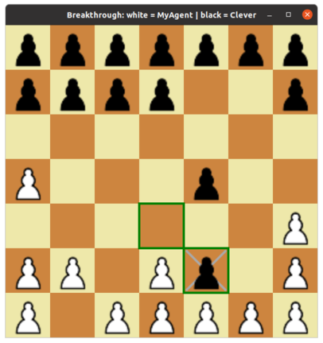

## Programming 2: Breakthrough



This is a C# implementation of the game of [Breakthrough](https://en.wikipedia.org/wiki/Breakthrough_(board_game)).  It includes a computer player named Clever that plays using a set of simple heuristics.  You may attempt to write your own agent that can defeat Clever.

The game includes a graphical interface that lets you play interactively against a computer player, or watch two computer players play each other.  I've provided two versions of the user interface code, one using GTK 2 and the other using Windows Forms.

The game also includes a command-line interface that lets you run a series of simulated games between two computer players to see which is stronger.

Breakthrough can be played on boards of various sizes, but in this implementation the board is always 7 x 7.

### Building the game

On Linux or macOS, you can build for GTK and Mono like this:

```
$ msbuild breakthrough_gtk.csproj
```

On Windows, you can build for .NET Core and Windows Forms like this:

```
$ dotnet build breakthrough_winforms.csproj
```

### Playing the game

If you run the executable with no command-line arguments, the graphical interface appears.  By default, the computer agent Clever will play the black pieces.  You may play white against Clever manually: click on the piece you'd like to move, then click where you'd like it to go.  Alternatively, press the space bar repeatedly to watch MyAgent (white) play against clever (Black).

The default implementation of MyAgent moves randomly.  It stands no chance against Clever, who will defeat it in every game.  You may attempt to improve MyAgent to be smart enough to beat Clever.

To run a series of games between MyAgent and Clever, run the executable from the command line and use the -sim option to specify the number of games.  For example:

```
$ mono breakthrough_gtk.exe -sim 5
playing 5 games
game 0: winner = Clever
game 1: winner = Clever
game 2: winner = Clever
game 3: winner = Clever
game 4: winner = Clever
MyAgent won 0, Clever won 5
MyAgent used 0.0 ms/move, Clever used 0.0 ms/move
$ 
```

Each game is played with a different random seed, which is the number displayed next to each game in the output above.  If you want to see the actual series of moves that were played in any of these games, run the executable and pass "-seed <num>".  That will display the graphical interface and allow you to step through that particular game.

Clever plays somewhat randomly, so different random seeds will usually lead to different games even if your agent is deterministic.  In particular, Clever's first move is always random.

One more command line option is available: "-swap" swaps the players, so that MyAgent plays Black and Clever plays White.  This works either when launching the graphical interface or when running a series of simulated games.

### Writing an agent

To improve MyAgent, you will need to modify its chooseMove method, which receives the current game state (a Game object) and decides which move to make.  Read the source code for game.cs to learn about the public fields of the Game class.  Your code can examine these to learn about the current game state.
